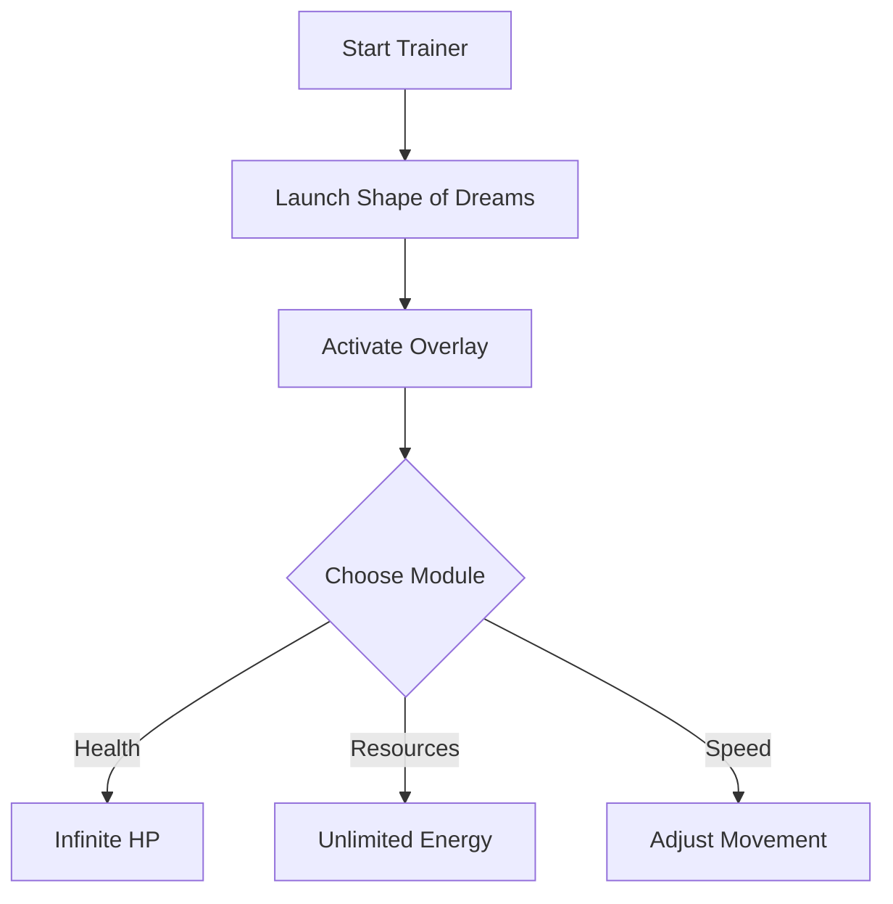

# Shape of Dreams Trainer 🌙

The **Shape of Dreams Trainer Tool** is built for players who want to explore and practice with **flexibility, safety, and control**. By adjusting parameters such as health, resources, and speed, this trainer lets you focus on testing builds, experimenting with combat, and exploring freely.

---

## 📝 Overview

Shape of Dreams is all about atmosphere and challenge. Sometimes, though, you want to **train mechanics**, **analyze boss patterns**, or **experiment with game systems** without restrictions. This trainer provides a modular way to do just that—without altering your original save files.

\[!NOTE]
Trainer tools are best used for **practice and testing**. Keep a backup of your save to preserve your main progress.


[](#)
[](#)
[](#)
[](#)


---

## ⭐ Features

* **Infinite Health Toggle** – Practice boss fights without instant resets.
* **Resource Management** – Unlimited energy, gold, or collectibles.
* **Speed Adjustment** – Slow down or accelerate movement to test platforming.
* **Teleport Function** – Instantly jump to specific map areas.
* **Custom Hotkeys** – Assign your own keys to activate trainer modules.
* **Overlay Menu** – Manage active cheats in real time.

---

## 🖥 Compatibility

| Platform       | Supported | Notes                     |
| -------------- | --------- | ------------------------- |
| Windows 10/11  | ✅         | Fully supported           |
| Linux (Proton) | ⚠️        | May need tweaks           |
| Steam Deck     | ⚠️        | Overlay partially limited |
| macOS          | ❌         | Not supported             |

\[!IMPORTANT]
Accessibility options: text size and overlay transparency can be adjusted for visibility.

---

## ⚡ Setup Guide

1. **Download** the Shape of Dreams Trainer package.
2. **Extract** files into the game’s root folder.
3. Run `Trainer.exe` as administrator.
4. Launch the game and press `F1` to open the trainer overlay.
5. Toggle modules using hotkeys or the in-game menu.

```bash
# Example config file
[trainer]
health=on
energy=unlimited
speed=1.5x
hotkey_health=F2
hotkey_speed=F3
```

---

## 🔄 Flow Diagram



---

## ❓ FAQ

**Q: Does this modify save files?**
A: No, it runs in memory only. Saves remain intact if you disable the trainer.

**Q: Can I use this offline?**
A: Yes, the trainer works without an internet connection.

**Q: Will performance drop?**
A: The tool is lightweight, with negligible system impact.

**Q: Are hotkeys customizable?**
A: Yes, all commands can be remapped via `config.ini`.

**Q: Does it support controller users?**
A: Trainer features are activated via keyboard, but controller play is unaffected.

---

## 🚀 Final Thoughts

The **Shape of Dreams Trainer Tool** offers a balance of **freedom and control**, letting you refine gameplay, test mechanics, and unlock deeper exploration. With configs, overlays, and hotkey toggles, it’s the perfect way to practice without limits.

---
